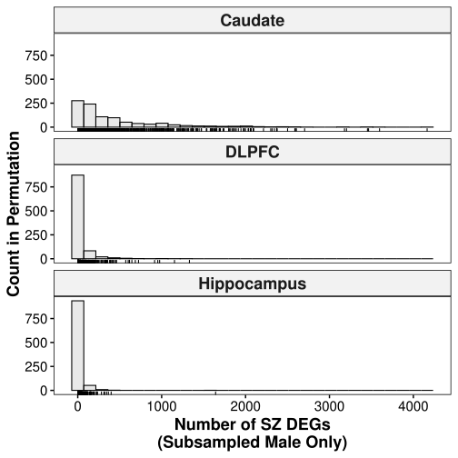

# Boxplots for permutations analysis (male downsampling to female level)


```R
library(tidyverse)
library(ggpubr)
```

    ── Attaching packages ─────────────────────────────────────── tidyverse 1.3.0 ──
    
    ✔ ggplot2 3.3.6     ✔ purrr   0.3.4
    ✔ tibble  3.1.7     ✔ dplyr   1.0.9
    ✔ tidyr   1.2.0     ✔ stringr 1.4.0
    ✔ readr   1.4.0     ✔ forcats 0.5.1
    
    ── Conflicts ────────────────────────────────────────── tidyverse_conflicts() ──
    ✖ dplyr::filter() masks stats::filter()
    ✖ dplyr::lag()    masks stats::lag()
    


## Function and configuration


```R
config = list(
    "Caudate"="../../../caudate/subsampling_male/deg_summary/_m/permutations.csv", 
    "DLPFC"="../../../dlpfc/subsampling_male/deg_summary/_m/permutations.csv", 
    "Hippocampus"="../../../hippocampus/subsampling_male/deg_summary/_m/permutations.csv"
)
```


```R
save_ggplots <- function(p, fn, w=6, h=6){
    for(ext in c('.svg', '.png', '.pdf')){
        ggsave(p, filename=paste0(fn, ext), width=w, height=h)
    }
}

merge_data <- function(){
    datalist = list()
    for(tissue in c("Caudate", "DLPFC", "Hippocampus")){
        df = data.table::fread(config[[tissue]])
        df$Tissue <- tissue  # maybe you want to keep track of which iteration produced it?
        datalist[[tissue]] <- df
    }
    return(bind_rows(datalist) %>% 
           select(Symbol, gencodeID, logFC, t, adj.P.Val, Permutation, Tissue))
}

get_perm_data <- function(df, tissue){
    return(df %>% group_by(Permutation, Tissue) %>% 
           summarize(Size = n()) %>% 
           replace_na(list(DLPFC = 0, Hippocampus = 0, Caudate = 0)) %>% 
           filter(`Tissue` == tissue))
}

get_female_degs <- function(tissue){
    fn = paste0("../../../", tolower(tissue), 
                "/female_analysis/_m/genes/diffExpr_szVctl_full.txt")
    return(data.table::fread(fn) %>% filter("adj.P.Val" < 0.05))
}

cal_zscore <- function(df, tissue){
    x = dim(get_female_degs(tissue))[1]
    mu = mean(get_perm_data(df, tissue)$Size)
    sigma = sd(get_perm_data(df, tissue)$Size)
    return((x - mu) / sigma)
}
```

## Merge dataframes


```R
big_df <- merge_data()
big_df %>% head()
```


<table class="dataframe">
<caption>A data.table: 6 × 7</caption>
<thead>
	<tr><th scope=col>Symbol</th><th scope=col>gencodeID</th><th scope=col>logFC</th><th scope=col>t</th><th scope=col>adj.P.Val</th><th scope=col>Permutation</th><th scope=col>Tissue</th></tr>
	<tr><th scope=col>&lt;chr&gt;</th><th scope=col>&lt;chr&gt;</th><th scope=col>&lt;dbl&gt;</th><th scope=col>&lt;dbl&gt;</th><th scope=col>&lt;dbl&gt;</th><th scope=col>&lt;int&gt;</th><th scope=col>&lt;chr&gt;</th></tr>
</thead>
<tbody>
	<tr><td>GDNF-AS1</td><td>ENSG00000248587.7 </td><td>0.8247287</td><td>8.000253</td><td>3.219110e-08</td><td>266</td><td>Caudate</td></tr>
	<tr><td>SLC24A3 </td><td>ENSG00000185052.11</td><td>0.2920501</td><td>6.148298</td><td>1.485328e-04</td><td>266</td><td>Caudate</td></tr>
	<tr><td>        </td><td>ENSG00000240521.1 </td><td>0.9333908</td><td>5.918368</td><td>2.194000e-04</td><td>266</td><td>Caudate</td></tr>
	<tr><td>KCNS2   </td><td>ENSG00000156486.7 </td><td>0.4139240</td><td>5.832974</td><td>2.194000e-04</td><td>266</td><td>Caudate</td></tr>
	<tr><td>VWC2    </td><td>ENSG00000188730.4 </td><td>0.4051942</td><td>5.830198</td><td>2.194000e-04</td><td>266</td><td>Caudate</td></tr>
	<tr><td>KCNH5   </td><td>ENSG00000140015.19</td><td>0.4670138</td><td>5.826467</td><td>2.194000e-04</td><td>266</td><td>Caudate</td></tr>
</tbody>
</table>


## Calculate significance


```R
z_scores = c(); two_tail = c(); tissues = c();
for(tissue in c("Caudate", "DLPFC", "Hippocampus")){
    tissues = c(tissues, tissue)
    ## Z-score
    q = cal_zscore(big_df, tissue); z_scores = c(z_scores, q)
    ## Convert to p-value
    two_tail = c(two_tail, 2*pnorm(q, mean=0, sd=1, lower.tail=TRUE))
}

dt = data.frame("Tissue"=tissues, "Z_score"=z_scores, "P_Value"=two_tail)
dt
```

    `summarise()` has grouped output by 'Permutation'. You can override using the
    `.groups` argument.
    `summarise()` has grouped output by 'Permutation'. You can override using the
    `.groups` argument.
    `summarise()` has grouped output by 'Permutation'. You can override using the
    `.groups` argument.
    `summarise()` has grouped output by 'Permutation'. You can override using the
    `.groups` argument.
    `summarise()` has grouped output by 'Permutation'. You can override using the
    `.groups` argument.
    `summarise()` has grouped output by 'Permutation'. You can override using the
    `.groups` argument.


<table class="dataframe">
<caption>A data.frame: 3 × 3</caption>
<thead>
	<tr><th scope=col>Tissue</th><th scope=col>Z_score</th><th scope=col>P_Value</th></tr>
	<tr><th scope=col>&lt;fct&gt;</th><th scope=col>&lt;dbl&gt;</th><th scope=col>&lt;dbl&gt;</th></tr>
</thead>
<tbody>
	<tr><td>Caudate    </td><td>-0.7698913</td><td>0.4413644</td></tr>
	<tr><td>DLPFC      </td><td>-0.4617181</td><td>0.6442835</td></tr>
	<tr><td>Hippocampus</td><td>-0.3906155</td><td>0.6960814</td></tr>
</tbody>
</table>


```R
dt %>% data.table::fwrite("permutation_pvalues.tsv", sep='\t')
```

## Plot figures


```R
df = big_df %>% group_by(Permutation, Tissue) %>% summarize(Size = n()) %>%
    as.data.frame %>% pivot_wider(names_from = Tissue, values_from = Size) %>%
    replace_na(list(DLPFC = 0, Hippocampus = 0, Caudate = 0)) %>% 
    pivot_longer(-Permutation, names_to="Tissue", values_to="DEGs") %>%
    mutate_if(is.character, as.factor)
df %>% head()
```

    `summarise()` has grouped output by 'Permutation'. You can override using the
    `.groups` argument.


<table class="dataframe">
<caption>A tibble: 6 × 3</caption>
<thead>
	<tr><th scope=col>Permutation</th><th scope=col>Tissue</th><th scope=col>DEGs</th></tr>
	<tr><th scope=col>&lt;int&gt;</th><th scope=col>&lt;fct&gt;</th><th scope=col>&lt;int&gt;</th></tr>
</thead>
<tbody>
	<tr><td>1</td><td>Caudate    </td><td>324</td></tr>
	<tr><td>1</td><td>DLPFC      </td><td>  1</td></tr>
	<tr><td>1</td><td>Hippocampus</td><td>  1</td></tr>
	<tr><td>2</td><td>Caudate    </td><td> 38</td></tr>
	<tr><td>2</td><td>DLPFC      </td><td>  0</td></tr>
	<tr><td>2</td><td>Hippocampus</td><td> 13</td></tr>
</tbody>
</table>


```R
hist = gghistogram(df, x="DEGs", fill="lightgray", bins=30, rug=TRUE, 
                   facet.by="Tissue", ncol=1, ylab="Count in Permutation",
                   xlab="Number of SZ DEGs\n(Subsampled Male Only)",
                   panel.labs.font=list(face='bold', size=18),
                   ggtheme=theme_pubr(base_size=15, border=TRUE)) + 
        font("xy.title", face="bold", size=18)
hist
```


    

    


```R
save_ggplots(hist, "permutation_histogram", 6, 7)
```

## Permutation DEGs Summary


```R
big_df %>% group_by(Permutation, Tissue) %>% summarize(Size = n()) %>%
    as.data.frame %>% pivot_wider(names_from = Tissue, values_from = Size) %>%
    replace_na(list(DLPFC = 0, Hippocampus = 0, Caudate = 0)) %>% 
    pivot_longer(-Permutation, names_to="Tissue", values_to="DEGs") %>%
    mutate_if(is.character, as.factor) %>% 
    group_by(Tissue) %>% summarize(Mean = mean(DEGs), Median = median(DEGs), Std = sd(DEGs))
```

    `summarise()` has grouped output by 'Permutation'. You can override using the
    `.groups` argument.


<table class="dataframe">
<caption>A tibble: 3 × 4</caption>
<thead>
	<tr><th scope=col>Tissue</th><th scope=col>Mean</th><th scope=col>Median</th><th scope=col>Std</th></tr>
	<tr><th scope=col>&lt;fct&gt;</th><th scope=col>&lt;dbl&gt;</th><th scope=col>&lt;dbl&gt;</th><th scope=col>&lt;dbl&gt;</th></tr>
</thead>
<tbody>
	<tr><td>Caudate    </td><td>433.23046</td><td>200.5</td><td>564.51642</td></tr>
	<tr><td>DLPFC      </td><td> 35.94088</td><td>  1.0</td><td>112.81116</td></tr>
	<tr><td>Hippocampus</td><td> 15.01503</td><td>  0.0</td><td> 65.57993</td></tr>
</tbody>
</table>


## Reproducibility Information


```R
Sys.time()
proc.time()
options(width = 120)
sessioninfo::session_info()
```


    [1] "2022-09-13 21:11:05 EDT"


       user  system elapsed 
      5.403   0.465  17.568 


    ─ Session info ───────────────────────────────────────────────────────────────────────────────────────────────────────
     setting  value                       
     version  R version 3.6.1 (2019-07-05)
     os       CentOS Linux 7 (Core)       
     system   x86_64, linux-gnu           
     ui       X11                         
     language (EN)                        
     collate  en_US.UTF-8                 
     ctype    en_US.UTF-8                 
     tz       US/Eastern                  
     date     2022-09-13                  
    
    ─ Packages ───────────────────────────────────────────────────────────────────────────────────────────────────────────
     package     * version    date       lib source                            
     abind         1.4-5      2016-07-21 [1] CRAN (R 3.6.1)                    
     assertthat    0.2.1      2019-03-21 [2] CRAN (R 3.6.1)                    
     backports     1.2.1      2020-12-09 [2] CRAN (R 3.6.1)                    
     base64enc     0.1-3      2015-07-28 [2] CRAN (R 3.6.1)                    
     broom         0.8.0      2022-04-13 [1] CRAN (R 3.6.1)                    
     car           3.0-13     2022-05-02 [1] CRAN (R 3.6.1)                    
     carData       3.0-5      2022-01-06 [1] CRAN (R 3.6.1)                    
     cellranger    1.1.0      2016-07-27 [2] CRAN (R 3.6.1)                    
     cli           3.3.0      2022-04-25 [1] CRAN (R 3.6.1)                    
     colorspace    2.0-0      2020-11-11 [2] CRAN (R 3.6.1)                    
     crayon        1.5.1      2022-03-26 [1] CRAN (R 3.6.1)                    
     data.table    1.14.2     2021-09-27 [1] CRAN (R 3.6.1)                    
     DBI           1.1.2      2021-12-20 [1] CRAN (R 3.6.1)                    
     dbplyr        2.0.0      2020-11-03 [2] CRAN (R 3.6.1)                    
     digest        0.6.29     2021-12-01 [1] CRAN (R 3.6.1)                    
     dplyr       * 1.0.9      2022-04-28 [1] CRAN (R 3.6.1)                    
     ellipsis      0.3.2      2021-04-29 [1] CRAN (R 3.6.1)                    
     evaluate      0.16       2022-08-09 [1] CRAN (R 3.6.1)                    
     fansi         1.0.3      2022-03-24 [1] CRAN (R 3.6.1)                    
     farver        2.0.3      2020-01-16 [2] CRAN (R 3.6.1)                    
     fastmap       1.1.0      2021-01-25 [1] CRAN (R 3.6.1)                    
     forcats     * 0.5.1      2021-01-27 [1] CRAN (R 3.6.1)                    
     fs            1.5.2      2021-12-08 [1] CRAN (R 3.6.1)                    
     generics      0.1.2      2022-01-31 [1] CRAN (R 3.6.1)                    
     ggplot2     * 3.3.6      2022-05-03 [1] CRAN (R 3.6.1)                    
     ggpubr      * 0.4.0      2020-06-27 [1] CRAN (R 3.6.1)                    
     ggsignif      0.6.3      2021-09-09 [1] CRAN (R 3.6.1)                    
     glue          1.6.2      2022-02-24 [1] CRAN (R 3.6.1)                    
     gtable        0.3.0      2019-03-25 [2] CRAN (R 3.6.1)                    
     haven         2.5.0      2022-04-15 [1] CRAN (R 3.6.1)                    
     hms           1.1.1      2021-09-26 [1] CRAN (R 3.6.1)                    
     htmltools     0.5.3      2022-07-18 [1] CRAN (R 3.6.1)                    
     httr          1.4.2      2020-07-20 [2] CRAN (R 3.6.1)                    
     IRdisplay     1.1        2022-01-04 [1] CRAN (R 3.6.1)                    
     IRkernel      1.3.0.9000 2022-08-26 [1] Github (IRkernel/IRkernel@c674f3c)
     jsonlite      1.8.0      2022-02-22 [1] CRAN (R 3.6.1)                    
     labeling      0.4.2      2020-10-20 [2] CRAN (R 3.6.1)                    
     lifecycle     1.0.1      2021-09-24 [1] CRAN (R 3.6.1)                    
     lubridate     1.8.0      2021-10-07 [1] CRAN (R 3.6.1)                    
     magrittr      2.0.3      2022-03-30 [1] CRAN (R 3.6.1)                    
     modelr        0.1.8      2020-05-19 [2] CRAN (R 3.6.1)                    
     munsell       0.5.0      2018-06-12 [2] CRAN (R 3.6.1)                    
     pbdZMQ        0.3-7      2022-02-05 [1] CRAN (R 3.6.1)                    
     pillar        1.8.1      2022-08-19 [1] CRAN (R 3.6.1)                    
     pkgconfig     2.0.3      2019-09-22 [2] CRAN (R 3.6.1)                    
     purrr       * 0.3.4      2020-04-17 [1] CRAN (R 3.6.1)                    
     R6            2.5.0      2020-10-28 [2] CRAN (R 3.6.1)                    
     Rcpp          1.0.8.3    2022-03-17 [1] CRAN (R 3.6.1)                    
     readr       * 1.4.0      2020-10-05 [2] CRAN (R 3.6.1)                    
     readxl        1.3.1      2019-03-13 [2] CRAN (R 3.6.1)                    
     repr          1.1.4      2022-01-04 [1] CRAN (R 3.6.1)                    
     reprex        2.0.1      2021-08-05 [1] CRAN (R 3.6.1)                    
     rlang         1.0.2      2022-03-04 [1] CRAN (R 3.6.1)                    
     rstatix       0.7.0      2021-02-13 [1] CRAN (R 3.6.1)                    
     rstudioapi    0.13       2020-11-12 [2] CRAN (R 3.6.1)                    
     rvest         1.0.2      2021-10-16 [1] CRAN (R 3.6.1)                    
     scales        1.1.1      2020-05-11 [2] CRAN (R 3.6.1)                    
     sessioninfo   1.1.1      2018-11-05 [2] CRAN (R 3.6.1)                    
     stringi       1.5.3      2020-09-09 [2] CRAN (R 3.6.1)                    
     stringr     * 1.4.0      2019-02-10 [2] CRAN (R 3.6.1)                    
     svglite       2.1.0      2022-02-03 [1] CRAN (R 3.6.1)                    
     systemfonts   1.0.4      2022-02-11 [1] CRAN (R 3.6.1)                    
     tibble      * 3.1.7      2022-05-03 [1] CRAN (R 3.6.1)                    
     tidyr       * 1.2.0      2022-02-01 [1] CRAN (R 3.6.1)                    
     tidyselect    1.1.2      2022-02-21 [1] CRAN (R 3.6.1)                    
     tidyverse   * 1.3.0      2019-11-21 [2] CRAN (R 3.6.1)                    
     utf8          1.2.2      2021-07-24 [1] CRAN (R 3.6.1)                    
     uuid          1.1-0      2022-04-19 [1] CRAN (R 3.6.1)                    
     vctrs         0.4.1      2022-04-13 [1] CRAN (R 3.6.1)                    
     withr         2.3.0      2020-09-22 [2] CRAN (R 3.6.1)                    
     xml2          1.3.2      2020-04-23 [2] CRAN (R 3.6.1)                    
    
    [1] /users/jbenjami/R/x86_64-pc-linux-gnu-library/3.6
    [2] /jhpce/shared/jhpce/core/R/3.6.1/lib64/R/library

