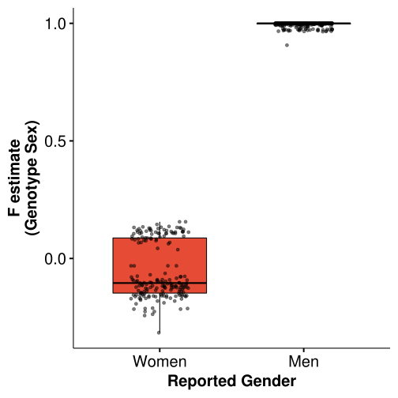

# Check sex chromosomes for caudate nucleus


```R
suppressMessages({library(dplyr)
                  library(ggpubr)})
```

## Get and annotated sex from genotypes


```R
sexcheck_file = paste0('../../../input/genotypes/check_sex/_m/', 
                       'LIBD_Brain_TopMed.sexcheck')
pheno_file = '../../..//input/phenotypes/_m/phenotypes.csv'

dt = data.table::fread(sexcheck_file) %>% 
    inner_join(data.table::fread(pheno_file), by=c("FID"="BrNum")) %>%
    select(c("FID", "Dx", "Sex", "Age", "F", "SNPSEX")) %>%
    distinct() %>% mutate_if(is.character, as.factor)
levels(dt$Sex) <- c('Woman', 'Man')
dt %>% head(2)
```


<table class="dataframe">
<caption>A data.table: 2 × 6</caption>
<thead>
	<tr><th scope=col>FID</th><th scope=col>Dx</th><th scope=col>Sex</th><th scope=col>Age</th><th scope=col>F</th><th scope=col>SNPSEX</th></tr>
	<tr><th scope=col>&lt;fct&gt;</th><th scope=col>&lt;fct&gt;</th><th scope=col>&lt;fct&gt;</th><th scope=col>&lt;dbl&gt;</th><th scope=col>&lt;dbl&gt;</th><th scope=col>&lt;int&gt;</th></tr>
</thead>
<tbody>
	<tr><td>Br763</td><td>Schizo </td><td>Man</td><td>75.22</td><td>1</td><td>1</td></tr>
	<tr><td>Br822</td><td>Control</td><td>Man</td><td>26.73</td><td>1</td><td>1</td></tr>
</tbody>
</table>


## Plot F estimate


```R
fig <- ggboxplot(dt, x = "Sex", y = "F", fill='Sex', width=0.65, palette='npg', 
                 xlab='Reported Gender', ylab='F estimate\n(Genotype Sex)', 
                 ggtheme=theme_pubr(base_size=20), add="jitter", 
                 add.params=list(alpha=0.5), legend="None") +
    font("xy.title", face='bold')
fig
```


    

    


```R
ggsave("sex_check.png")
ggsave("sex_check.pdf")
ggsave("sex_check.svg")
```

    Saving 6.67 x 6.67 in image
    
    Saving 6.67 x 6.67 in image
    
    Saving 6.67 x 6.67 in image
    


```R
dt %>%
  group_by(Sex) %>%
  summarize(mean_size = mean(F, na.rm = TRUE), max = max(F, na.rm=TRUE))
```


<table class="dataframe">
<caption>A tibble: 2 × 3</caption>
<thead>
	<tr><th scope=col>Sex</th><th scope=col>mean_size</th><th scope=col>max</th></tr>
	<tr><th scope=col>&lt;fct&gt;</th><th scope=col>&lt;dbl&gt;</th><th scope=col>&lt;dbl&gt;</th></tr>
</thead>
<tbody>
	<tr><td>Woman</td><td>-0.05355674</td><td>0.156</td></tr>
	<tr><td>Man  </td><td> 0.99623137</td><td>1.000</td></tr>
</tbody>
</table>


## Check that reported gender matches genotype sex


```R
sum(dt$Sex == "Man")
sum(dt$SNPSEX == 1 & dt$Sex == "Man")
```


408


408


```R
sum(dt$Sex == "Woman")
sum(dt$SNPSEX == 2 & dt$Sex == "Woman")
```


187


187


### Examine number of X chromosomes


```R
table(dt$SNPSEX)
```


    
      1   2 
    408 187 


```R
table(dt$Sex)
```


    
    Woman   Man 
      187   408 


#### Summary: All samples have reported gender matching genotype sex

## Reproducibility Information


```R
Sys.time()
proc.time()
options(width = 120)
sessioninfo::session_info()
```


    [1] "2022-09-09 13:27:12 EDT"


       user  system elapsed 
      3.960   0.401  12.258 


    ─ Session info ───────────────────────────────────────────────────────────────────────────────────────────────────────
     setting  value                       
     version  R version 3.6.1 (2019-07-05)
     os       CentOS Linux 7 (Core)       
     system   x86_64, linux-gnu           
     ui       X11                         
     language (EN)                        
     collate  en_US.UTF-8                 
     ctype    en_US.UTF-8                 
     tz       US/Eastern                  
     date     2022-09-09                  
    
    ─ Packages ───────────────────────────────────────────────────────────────────────────────────────────────────────────
     package     * version    date       lib source                            
     abind         1.4-5      2016-07-21 [1] CRAN (R 3.6.1)                    
     assertthat    0.2.1      2019-03-21 [2] CRAN (R 3.6.1)                    
     backports     1.2.1      2020-12-09 [2] CRAN (R 3.6.1)                    
     base64enc     0.1-3      2015-07-28 [2] CRAN (R 3.6.1)                    
     broom         0.8.0      2022-04-13 [1] CRAN (R 3.6.1)                    
     car           3.0-13     2022-05-02 [1] CRAN (R 3.6.1)                    
     carData       3.0-5      2022-01-06 [1] CRAN (R 3.6.1)                    
     cli           3.3.0      2022-04-25 [1] CRAN (R 3.6.1)                    
     colorspace    2.0-0      2020-11-11 [2] CRAN (R 3.6.1)                    
     crayon        1.5.1      2022-03-26 [1] CRAN (R 3.6.1)                    
     data.table    1.14.2     2021-09-27 [1] CRAN (R 3.6.1)                    
     DBI           1.1.2      2021-12-20 [1] CRAN (R 3.6.1)                    
     digest        0.6.29     2021-12-01 [1] CRAN (R 3.6.1)                    
     dplyr       * 1.0.9      2022-04-28 [1] CRAN (R 3.6.1)                    
     ellipsis      0.3.2      2021-04-29 [1] CRAN (R 3.6.1)                    
     evaluate      0.16       2022-08-09 [1] CRAN (R 3.6.1)                    
     fansi         1.0.3      2022-03-24 [1] CRAN (R 3.6.1)                    
     farver        2.0.3      2020-01-16 [2] CRAN (R 3.6.1)                    
     fastmap       1.1.0      2021-01-25 [1] CRAN (R 3.6.1)                    
     generics      0.1.2      2022-01-31 [1] CRAN (R 3.6.1)                    
     ggplot2     * 3.3.6      2022-05-03 [1] CRAN (R 3.6.1)                    
     ggpubr      * 0.4.0      2020-06-27 [1] CRAN (R 3.6.1)                    
     ggsci         2.9        2018-05-14 [1] CRAN (R 3.6.1)                    
     ggsignif      0.6.3      2021-09-09 [1] CRAN (R 3.6.1)                    
     glue          1.6.2      2022-02-24 [1] CRAN (R 3.6.1)                    
     gtable        0.3.0      2019-03-25 [2] CRAN (R 3.6.1)                    
     htmltools     0.5.3      2022-07-18 [1] CRAN (R 3.6.1)                    
     IRdisplay     1.1        2022-01-04 [1] CRAN (R 3.6.1)                    
     IRkernel      1.3.0.9000 2022-08-26 [1] Github (IRkernel/IRkernel@c674f3c)
     jsonlite      1.8.0      2022-02-22 [1] CRAN (R 3.6.1)                    
     labeling      0.4.2      2020-10-20 [2] CRAN (R 3.6.1)                    
     lifecycle     1.0.1      2021-09-24 [1] CRAN (R 3.6.1)                    
     magrittr      2.0.3      2022-03-30 [1] CRAN (R 3.6.1)                    
     munsell       0.5.0      2018-06-12 [2] CRAN (R 3.6.1)                    
     pbdZMQ        0.3-7      2022-02-05 [1] CRAN (R 3.6.1)                    
     pillar        1.8.1      2022-08-19 [1] CRAN (R 3.6.1)                    
     pkgconfig     2.0.3      2019-09-22 [2] CRAN (R 3.6.1)                    
     purrr         0.3.4      2020-04-17 [1] CRAN (R 3.6.1)                    
     R6            2.5.0      2020-10-28 [2] CRAN (R 3.6.1)                    
     repr          1.1.4      2022-01-04 [1] CRAN (R 3.6.1)                    
     rlang         1.0.2      2022-03-04 [1] CRAN (R 3.6.1)                    
     rstatix       0.7.0      2021-02-13 [1] CRAN (R 3.6.1)                    
     scales        1.1.1      2020-05-11 [2] CRAN (R 3.6.1)                    
     sessioninfo   1.1.1      2018-11-05 [2] CRAN (R 3.6.1)                    
     svglite       2.1.0      2022-02-03 [1] CRAN (R 3.6.1)                    
     systemfonts   1.0.4      2022-02-11 [1] CRAN (R 3.6.1)                    
     tibble        3.1.7      2022-05-03 [1] CRAN (R 3.6.1)                    
     tidyr         1.2.0      2022-02-01 [1] CRAN (R 3.6.1)                    
     tidyselect    1.1.2      2022-02-21 [1] CRAN (R 3.6.1)                    
     utf8          1.2.2      2021-07-24 [1] CRAN (R 3.6.1)                    
     uuid          1.1-0      2022-04-19 [1] CRAN (R 3.6.1)                    
     vctrs         0.4.1      2022-04-13 [1] CRAN (R 3.6.1)                    
     withr         2.3.0      2020-09-22 [2] CRAN (R 3.6.1)                    
    
    [1] /users/jbenjami/R/x86_64-pc-linux-gnu-library/3.6
    [2] /jhpce/shared/jhpce/core/R/3.6.1/lib64/R/library

